  <!-- dynamic typing effect 动态打字效果 -->
  

    
  

  <!-- knock code pictures 敲代码的图片 -->
  <picture>
    <source media="(prefers-color-scheme: dark)" srcset="https://cdn.jsdelivr.net/gh/Leon2young/Leon2young/assets/images/peipei-dark.gif" />
    <source media="(prefers-color-scheme: light)" srcset="https://cdn.jsdelivr.net/gh/Leon2young/Leon2young/assets/images/peipei-light.gif" height="225px" />
    
  </picture>

  <!-- profile logo 个人资料徽标 -->
  

    &emsp;
    &emsp;
    &emsp;
    &emsp;
    &emsp;
    <!-- visitor statistics logo 访问量统计徽标 -->
    &emsp;
    <!-- wakatime -->    
    
  

<!-- Snake Code Contribution Map 贪吃蛇代码贡献图 -->

<picture>
  <source media="(prefers-color-scheme: dark)" srcset="https://cdn.jsdelivr.net/gh/Leon2young/Leon2young/profile-snake-contrib/github-contribution-grid-snake-dark.svg" />
  <source media="(prefers-color-scheme: light)" srcset="https://cdn.jsdelivr.net/gh/Leon2young/Leon2young/profile-snake-contrib/github-contribution-grid-snake.svg" />
  
</picture>

#  🙋 Hello
<table>
<tr><td>
<!-- About me 关于我 -->

### 🤺 About Me

&emsp;&emsp;Bonjour, je suis Leon2young.

&emsp;&emsp;Passionate about programming, photography, reading, and traveling.

&emsp;&emsp;Devoted to the fields of data mining and artificial intelligence, aspiring to become an excellent developer.

<strong>&emsp;&emsp;We're making the world a better place. Through constructing elegant hierarchies for maximum code reuse and extensibility.</strong>

</td></tr>

<tr><td>

### 🤾‍♂️ Funny Soul

<!-- START_SECTION:douban -->
* <a href='https://book.douban.com/subject/35193035/' target='_blank'>《认知觉醒》</a> 最近在读🌟🌟🌟🌟🌟
* <a href='http://movie.douban.com/subject/1292052/' target='_blank'>《肖申克的救赎》</a> 喜欢的电影🌟🌟🌟🌟🌟 
* <a href='http://movie.douban.com/subject/1292365/' target='_blank'>《活着》</a> 印象最深的书🌟🌟🌟🌟🌟
* <a href='https://music.douban.com/subject/30259081/' target='_blank'>《飞行器的执行周期》</a>最近在听专辑 🌟🌟🌟🌟🌟 
* <a href='http://movie.douban.com/subject/35465232/' target='_blank'>《狂飙》</a> 喜欢的电视剧🌟🌟🌟🌟🌟
<!-- END_SECTION:douban -->

</td></tr>

<tr><td>

<!-- wakatime 统计 -->

### 📊 WakaTime

<picture>
  <source
    srcset="https://github-readme-stats.vercel.app/api/wakatime?username=sun0225SUN&layout=compact&text_color=f0f6fc&bg_color=00000000&hide_border=true&hide_title=true"
    media="(prefers-color-scheme: dark)"
  />
  <source
    srcset="https://github-readme-stats.vercel.app/api/wakatime?username=sun0225SUN&layout=compact&text_color=1f2328&bg_color=00000000&hide_border=true&hide_title=true"
    media="(prefers-color-scheme: light), (prefers-color-scheme: no-preference)"
  />
  
</picture>
</td></tr>

<tr><td>
<!--END_SECTION:waka-->

</td></tr>
</table>

<!-- ########################################## 分割 ########################################## -->

<!-- Quotes 名人名言 -->

  
  
  

<!-- GitHub 奖杯🏆 -->
 

<!-- Awesome repo 比较好的仓库-->
<!--

  
-->

<!-- Wakatime Graph-->
<table>
  <tr>
    <td></td>
    <td></td>
  </tr>
</table>

<!-- ########################################## 分割 ########################################## -->

<!--  skill badge 技能徽章 -->
🧰 常用工具

<!-- programming tool icon 编程工具图标 -->
 

<!-- svg -->

 

 

<!-- gif -->

<!-- just foot-img 底图 -->

<!-- ########################################## 分割 ########################################## -->

